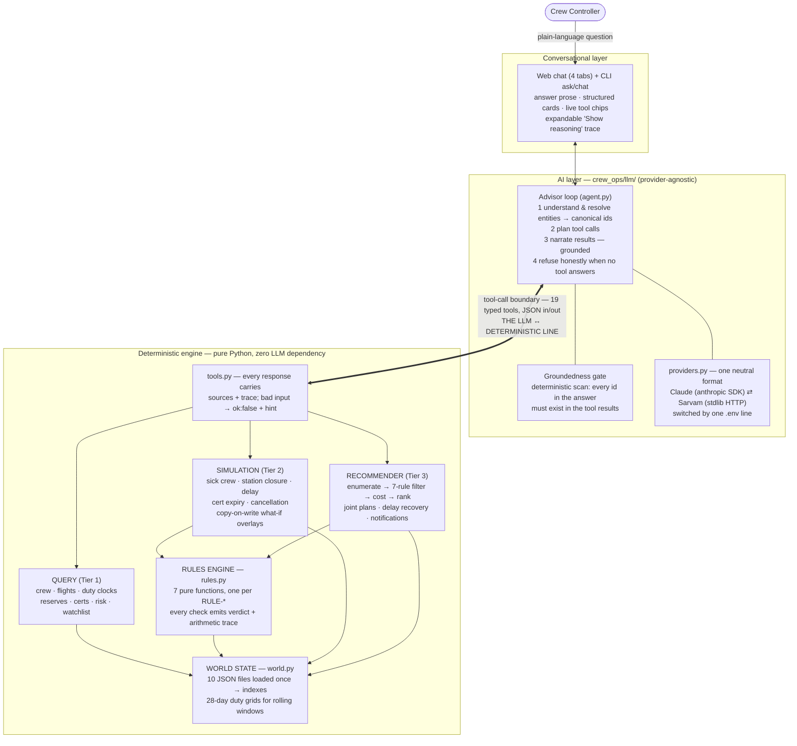
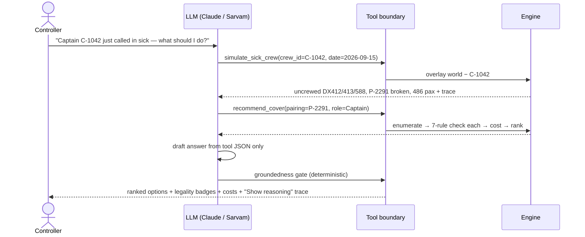
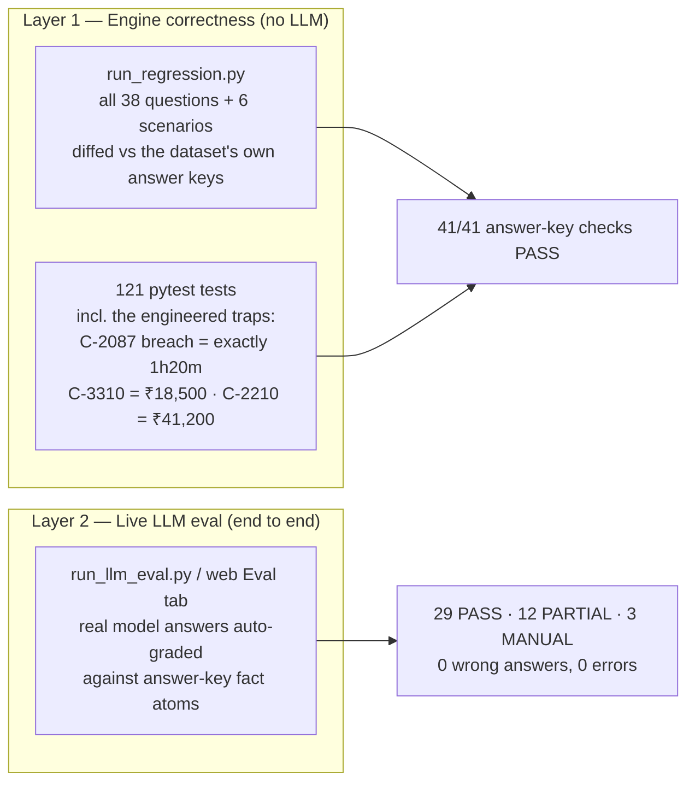

# Crew Ops Advisor — Architecture & Results

**dCortex "Agentic Crew Ops Advisor" hackathon · Team submission overview**

A conversational advisor for airline Crew Control: a controller asks a question in
plain language; the system answers correctly, fast, with reasoning it can prove —
and says so when it can't.

---

## 1. The central question, and our answer

The problem statement asks one architectural question:

> *What should the language model do, what should deterministic code do, and how
> do you compose them into a system that is both conversational and correct?*

Our answer is a hard rule the whole system enforces:

> **The LLM never computes a number. Deterministic code never interprets language.**

- The LLM does three things: **understand** the question, **plan** tool calls,
  and **narrate** results in plain language.
- Every fact, hour, cost, legality verdict and ranking comes from a
  **deterministic Python engine** over the dataset — with a machine-generated
  arithmetic trace.
- A deterministic **groundedness gate** re-scans the LLM's final answer: any
  crew id, pairing, or flight number not present in the tool results is flagged
  as unverified. Invented facts are mechanically caught, not hoped away.

Why not the alternatives:

| Approach | Why it fails here |
|---|---|
| Put the JSON in the prompt, let the model answer | Works for Tier 1, fails Tiers 2–3. Rolling duty-window arithmetic is exactly what LLMs approximate wrong — fluently and confidently. A 1h20m error on RULE-DUTY-02 is a violation, not a rounding error. |
| LLM generates SQL/code per question | Freshly generated legality logic is wrong in unverifiable ways; same question can get different answers on different runs. |
| Rules engine + keyword NLU front end | Correct but brittle — fails "natural language is the primary interface" the moment phrasing varies. |
| **Ours: LLM tool-calling over a fixed, tested engine** | Rules written once, verified against the dataset's own answer keys, reused for every question. Same question → same numbers, every time. |

---

## 2. System architecture

**The LLM vs. deterministic boundary is the tool-call interface** — everything
above it is language, everything below it is arithmetic. This is the boundary
the evaluation criteria ask us to draw deliberately.

### What one question looks like end to end (Tier 3, the flagship scenario)

---

## 3. Requirements coverage — what was asked vs. what the repo has

### The three tiers

| Tier | Asked | Status in repo |
|---|---|---|
| **Tier 1 — Lookup & Retrieval** (mandatory) | Reserves, duty hours, departures, expiring licences | ✅ 8 query tools (`crew_ops/query.py`) — all 16 Tier-1 answer keys pass, LLM eval 16/16 PASS |
| **Tier 2 — Consequence & Simulation** (strongly expected) | Sick calls, move-crew legality, station closures | ✅ Simulation engine + overlays (`crew_ops/simulation.py`), matches the spec's exact Tier-2 output shape |
| **Tier 3 — Recommendation & Action** (stretch) | Ranked, legal, costed options + reasoning; bonus: draft the crew notification | ✅ Recommender (`crew_ops/recommender.py`) incl. joint multi-sick plans, delay recovery, and `draft_notification` (bonus done) |

### Mandatory constraints

| Constraint | How it's met |
|---|---|
| Provided synthetic dataset only | World state loads exclusively from `data/*.json` |
| Natural language as primary interface | Web chat + CLI `ask`/`chat`; multi-turn with context retention |
| Non-trivial answers explainable | Trace is a **data structure generated by the computing code** — rule-by-rule arithmetic with source files, rendered under "Show reasoning". It cannot drift from the answer. |
| Answers grounded — invented facts are failures | Deterministic groundedness gate over every final answer |

### Optional enhancements delivered

Multi-turn conversation ✅ · drafting crew notifications ✅ · chained/simultaneous
disruptions ✅ (`recommend_joint`, overlay stacking) · proactive alerting ✅
(`get_duty_watchlist` early-warning list) · confidence signalling ✅ (sources +
rules-checked strip; unverified-id flags).

### Deliverables checklist

| Deliverable | Where |
|---|---|
| Source code repository | this repo, `solution/` |
| Architecture diagram incl. the LLM/deterministic boundary | this file + `solution/ARCHITECTURE.md` |
| README with setup, approach, trade-offs | `solution/README.md` |
| Sample inputs/outputs incl. a failure case with analysis | README "Known limitations" + eval transcripts in `solution/llm_eval_out/` |
| Presentation deck + live demo | this doc is the deck source; demo = `python3 server.py` |

---

## 4. The deterministic engine — why the numbers are right

- **7 rules, 7 pure functions** (`rules.py`), each returning
  `{rule_id, pass, computed, limit, margin, detail}`. `evaluate_cover` always
  runs **all 7** — so a legal option shows *what was checked*, not just an
  illegal one showing *why it failed* (exactly the `rules_checked` field the
  spec's Tier-3 output shape requires).
- **Calendar-window sums recomputed from the 28-day daily grid plus the proposed
  duty** — never the pre-baked `duty_hours_7d` snapshot, which is stale for any
  future date. This is the dataset's main correctness trap and it's encoded once.
- **Copy-on-write overlays** for what-ifs: a simulation layers a disruption delta
  over the base world — scenarios never contaminate each other, and chained
  disruptions are just a stack of overlays.
- Domain subtleties found by dataset archaeology and encoded: reserve on-call
  windows gate the *required report time* (the C-3305 day-2 trap), whole-duty
  shift vs. pre-duty delay are different FDP situations (S4), deadhead
  DEL→BLR rides real schedule legs with +15 min report, cancellation is always
  priced as an option so the ranking *shows* it losing.

---

## 5. Verification — how we know it's right

Two independent layers of evidence:

### Engine regression: **41/41**

Every auto-checkable answer key passes: all 16 Tier-1, 13/14 Tier-2, 6/8 Tier-3
(the 3 open-ended prose questions Q30/Q36/Q38 are flagged for human judging,
never auto-passed), and all 6 scenarios S1–S6. Because held-out scenarios reuse
the same event vocabulary, passing via a **general engine** — not answer-key
lookup — is the generalisation story.

### Live LLM eval (provider: `sarvam-105b`, full 44-item run)

| | PASS | PARTIAL | MANUAL | Wrong / Error |
|---|---|---|---|---|
| Tier 1 (16) | **16** | – | – | 0 |
| Tier 2 (14) | 10 | 3 | 1 | 0 |
| Tier 3 (8) | 3 | 3 | 2 | 0 |
| Scenarios (6) | – | 6 | – | 0 |
| **Total (44)** | **29** | **12** | **3** | **0** |

**How to read PARTIAL — this matters for the jury.** Grading is strict
atom-matching: the answer text must literally contain every fact atom of the
answer key. The PARTIALs are answers that are *correct but less exhaustive than
the key* — e.g. Q17 named all uncrewed flights but didn't restate "486
passengers"; the scenario keys list every ranked option's cost, while a good
conversational answer leads with the winner. The engine returned all those
numbers (verifiable in the saved transcripts); the narration just didn't recite
all of them. **No answer contained a wrong number and no invented facts got
through the gate** — which is the failure mode the scoring principles actually
penalise ("correctness outweighs coverage").

**Performance:** median **14 s** per answer, average 21 s, worst case 92 s on the
heaviest multi-tool scenario (engine time is <50 ms — the latency is model
round-trips). Well inside "usable on a live shift"; the worst case is our
documented tail, not the norm.

MANUAL = the three open-ended prose questions — the system produces grounded
drafts but refuses to pretend prose can be auto-verified.

Full transcripts: `solution/llm_eval_out/results.json` (also browsable in the
web UI's **Eval** tab, which can re-run the whole eval live).

---

## 6. Honest failure analysis (asked for explicitly — and rewarded)

1. **Entity resolution is the soft spot.** "The VT-DXE captain", "tomorrow" —
   resolution is the LLM's job. Mitigations: tools accept only canonical
   ids/dates so a bad resolution fails loudly (`ok: false` + hint), and resolved
   entities are echoed back ("Assuming you mean C-1042…") for the controller to
   catch. This is our documented failure case.
2. **Narration under-reports** (the PARTIALs above): correct but not exhaustive.
   Fixable with a "recite all ranked options" instruction at the cost of
   verbosity — a deliberate UX trade-off we can defend.
3. **Rest before a first cover duty** is only checkable via `last_rest_ended`
   (the daily history has no per-duty timestamps) — documented, with the dataset
   change that would make it exact.
4. **RULE-FLT-03 on covers** is checked *stricter* than the answer keys require
   (we count the cover's block hours into the 28-day window). On this dataset
   they never diverge; ours is the safer regulatory reading.
5. **Joint plans are exhaustive, not optimal** — fine at 2–3 simultaneous
   events; at real scale this becomes CP/MIP behind the same tool interface.
6. **Claude vs. Sarvam:** the full live eval ran on Sarvam; the Claude path is
   implemented and unit-tested (fake provider, both wire formats) but the graded
   run shown above is Sarvam's.

---

## 7. Scale & production notes (commentary, per the brief)

- **Scale:** at real-airline size (10⁴ crew, 10³ daily legs) the in-memory world
  moves to Postgres + an incremental legality cache keyed by (crew, date); the
  rules engine, trace format and tool boundary are unchanged — **the boundary is
  the durable design, not the storage**. The recommender graduates to CP/MIP
  behind the same tool.
- **PII:** the boundary helps here too — sensitive fields (phone-level
  reachability, medical data) simply never enter the prompt; the LLM sees crew
  ids. Tool calls are the audit log; the trace doubles as the audit record.

---

## 8. Demo script (5 minutes)

1. `python3 server.py` → **Chat** tab: a Tier-1 warm-up ("Who's on reserve at
   BLR tomorrow?") — instant, sourced.
2. The flagship: *"Captain C-1042 just called in sick for tomorrow — what should
   I do?"* — watch tool chips stream, ranked options with legality badges and
   itemized costs appear, expand **Show reasoning** and challenge one line of
   arithmetic.
3. Follow-up in the same thread: *"What about C-2210 instead?"* — multi-turn
   context + the deadhead cost story.
4. An out-of-scope question → honest refusal, live.
5. **Eval** tab: show the scoreboard the judges just read, being re-computed.

---

*The LLM is the interface, the engine is the authority, the trace is the
contract between them — and when the system isn't sure, it says so.*
