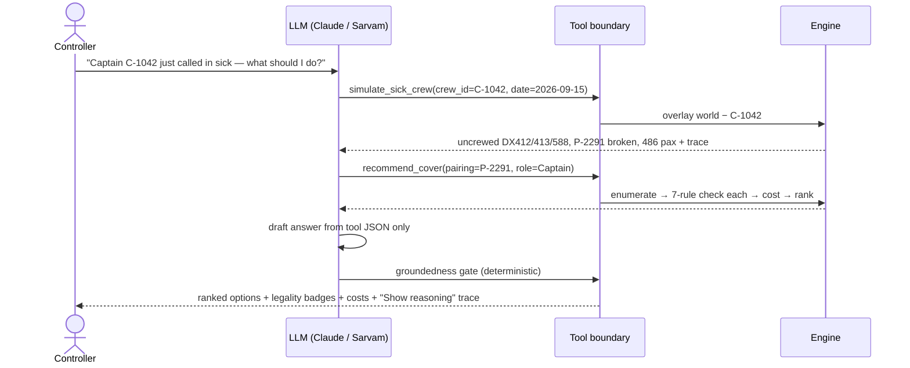
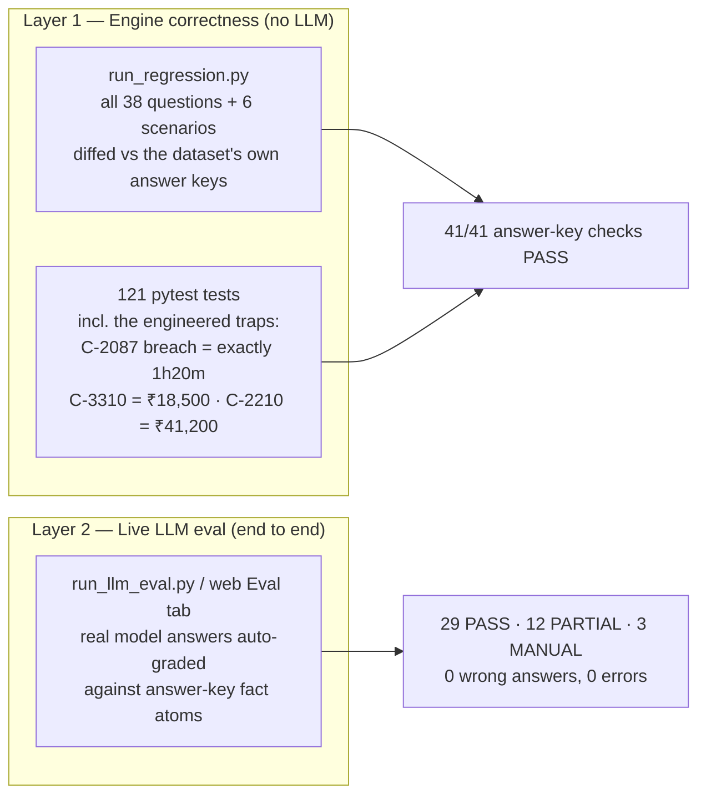
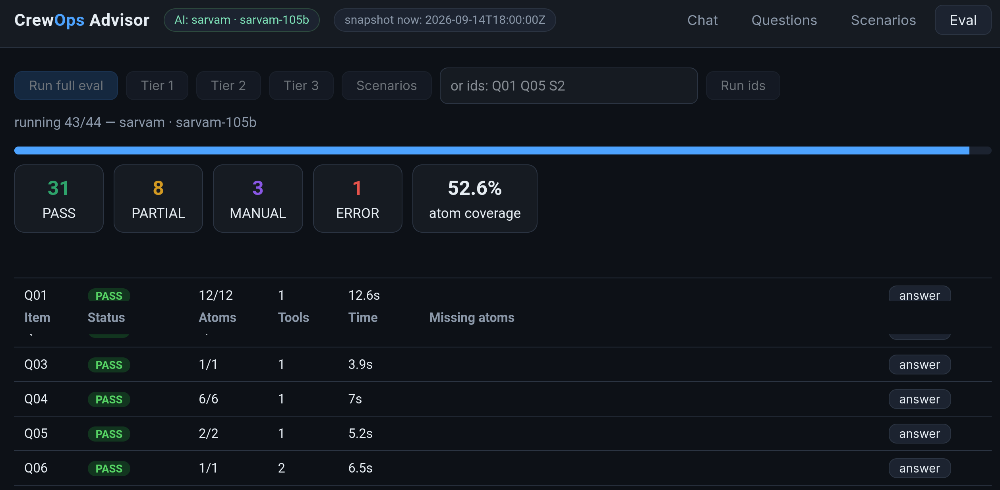
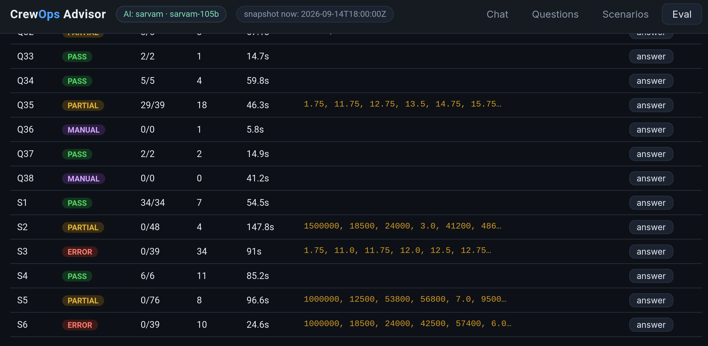

# Crew Ops Advisor — Architecture & Results

**dCortex "Agentic Crew Ops Advisor" hackathon · Team submission overview**

A conversational advisor for airline Crew Control: a controller asks a question in
plain language; the system answers correctly, fast, with reasoning it can prove —
and says so when it can't.

---

## 1. The central question, and our answer

The problem statement asks one architectural question:

> *What should the language model do, what should deterministic code do, and how
> do you compose them into a system that is both conversational and correct?*

Our answer is a hard rule the whole system enforces:

> **The LLM never computes a number. Deterministic code never interprets language.**

- The LLM does three things: **understand** the question, **plan** tool calls,
  and **narrate** results in plain language.
- Every fact, hour, cost, legality verdict and ranking comes from a
  **deterministic Python engine** over the dataset — with a machine-generated
  arithmetic trace.
- A deterministic **groundedness gate** re-scans the LLM's final answer: any
  crew id, pairing, or flight number not present in the tool results is flagged
  as unverified. Invented facts are mechanically caught, not hoped away.

Why not the alternatives:

| Approach | Why it fails here |
|---|---|
| Put the JSON in the prompt, let the model answer | Works for Tier 1, fails Tiers 2–3. Rolling duty-window arithmetic is exactly what LLMs approximate wrong — fluently and confidently. A 1h20m error on RULE-DUTY-02 is a violation, not a rounding error. |
| LLM generates SQL/code per question | Freshly generated legality logic is wrong in unverifiable ways; same question can get different answers on different runs. |
| Rules engine + keyword NLU front end | Correct but brittle — fails "natural language is the primary interface" the moment phrasing varies. |
| **Ours: LLM tool-calling over a fixed, tested engine** | Rules written once, verified against the dataset's own answer keys, reused for every question. Same question → same numbers, every time. |

---

## 2. System architecture


**The LLM vs. deterministic boundary is the tool-call interface** — everything
above it is language, everything below it is arithmetic. This is the boundary
the evaluation criteria ask us to draw deliberately.

### What one question looks like end to end (Tier 3, the flagship scenario)



### The 19 tools — the complete boundary

Every tool is registered in `crew_ops/tools.py` with a JSON-schema signature,
a description the LLM plans against, and a fixed list of the dataset files it
reads (returned as `sources` with every response). The contract is uniform:

```
dispatch(world, name, args) → {"ok": true, "result": …, "sources": [...], "trace": [...]}
                            | {"ok": false, "error": "…", "hint": "…"}   ← honest-refusal path
```

Bad ids/dates never raise — they come back as `ok: false` with a hint, which
the LLM is instructed to relay, not improvise around. An unknown tool name
returns the list of available tools.

**Tier 1 — Query (8 tools)** — required arguments marked `*`

| Tool | What it does | Key inputs | Reads |
|---|---|---|---|
| `lookup_crew` | Find crew by id / name / rank / base / status / rating | any filter combination | crew.json |
| `lookup_flights` | Filter the flight schedule | date, dep/arr station, flight_no, aircraft | flights.json |
| `get_duty_clock` | Rolling 7-day duty / 28-day flight-hour windows ending a given date (daily history **plus rostered duties**), with headroom vs. the limits | crew_id\*, end_date | duty_clocks, rosters, rules |
| `get_reserves` | Reserve pool with on-call windows | base, date | reserve_pool, crew |
| `get_certifications` | Certifications for one crew member, or all expiring in a window | crew_id, expiring_from/to | certifications |
| `get_risk_signals` | Pre-computed disruption-risk scores (provided input) | crew_id, min_score | risk_signals |
| `get_pairing` | Pairings with days, flights, report/release times and assigned crew | pairing_id, crew_id, aircraft, date | rosters |
| `get_duty_watchlist` | Crew at/above a 7-day duty-hour threshold — the proactive early-warning list | end_date\*, threshold (default 45 h) | duty_clocks, rosters |

**Tier 2 — Simulation & legality (7 tools)**

| Tool | What it does | Key inputs | Reads |
|---|---|---|---|
| `simulate_sick_crew` | Impact of a crew member dropping out: uncovered flights across all remaining pairing days, passengers affected, the broken pairing | crew_id\*, pairing_id, reported_utc | rosters, flights |
| `simulate_station_closure` | Flights hit by a closure window, plus a per-flight minimum-delay and FDP assessment | station\*, window_start_utc\*, window_end_utc\* | flights, rosters, rules |
| `simulate_delay` | A pre-duty delay shifts every leg: does the rostered crew's FDP still hold, and how many legs can they legally fly? | aircraft\*, date\*, delay_hours\* | flights, rosters, rules |
| `check_certification_validity` | Is this crew member legal to operate on this date? (RULE-CERT-06) | crew_id\*, date\* | certifications, rosters |
| `check_assignment_legality` | The full 7-rule check: can this crew cover this pairing (optionally from a date, with a delay)? Verdicts, issues **and the arithmetic trace** | crew_id\*, pairing_id\*, days_from, delay_hours | rosters, duty_clocks, certifications, rules |
| `compute_rest_requirement` | Earliest legal next report after a release time (RULE-REST-04) | release_utc\* | rules |
| `cancellation_impact` | Passengers affected and the direct cost of cancelling one leg | flight_id\* | flights, costs |

**Tier 3 — Recommendation & action (4 tools)**

| Tool | What it does | Key inputs | Reads |
|---|---|---|---|
| `recommend_cover` | Ranked, rule-checked, costed options to cover a role on a pairing — **including every rejected candidate and the exact rule that killed them** | pairing_id\*, role\*, sick_crew_id, days_from | crew, rosters, reserve_pool, duty_clocks, certifications, rules, costs |
| `recommend_joint` | Joint plan for simultaneous disruptions: no crew member used twice, total cost minimised | events\[\]\* (pairing, role, sick crew per event) | crew, rosters, reserve_pool, costs, rules |
| `recommend_delay_recovery` | Recovery when a delay breaches FDP: split the duty at the longest legal prefix, re-crew or cancel the tail, ranked by cost | aircraft\*, date\*, delay_hours\* | rosters, rules, costs |
| `draft_notification` | Structured callout facts + ready-to-send plain-text message for a chosen cover (the bonus deliverable) | crew_id\*, pairing_id\*, days_from | rosters, crew, flights |

---

## 3. Requirements coverage — what was asked vs. what the repo has

### The three tiers

| Tier | Asked | Status in repo |
|---|---|---|
| **Tier 1 — Lookup & Retrieval** (mandatory) | Reserves, duty hours, departures, expiring licences | ✅ 8 query tools (`crew_ops/query.py`) — all 16 Tier-1 answer keys pass, LLM eval 16/16 PASS |
| **Tier 2 — Consequence & Simulation** (strongly expected) | Sick calls, move-crew legality, station closures | ✅ Simulation engine + overlays (`crew_ops/simulation.py`), matches the spec's exact Tier-2 output shape |
| **Tier 3 — Recommendation & Action** (stretch) | Ranked, legal, costed options + reasoning; bonus: draft the crew notification | ✅ Recommender (`crew_ops/recommender.py`) incl. joint multi-sick plans, delay recovery, and `draft_notification` (bonus done) |

### Mandatory constraints

| Constraint | How it's met |
|---|---|
| Provided synthetic dataset only | World state loads exclusively from `data/*.json` |
| Natural language as primary interface | Web chat + CLI `ask`/`chat`; multi-turn with context retention |
| Non-trivial answers explainable | Trace is a **data structure generated by the computing code** — rule-by-rule arithmetic with source files, rendered under "Show reasoning". It cannot drift from the answer. |
| Answers grounded — invented facts are failures | Deterministic groundedness gate over every final answer |

### Optional enhancements delivered

Multi-turn conversation ✅ · drafting crew notifications ✅ · chained/simultaneous
disruptions ✅ (`recommend_joint`, overlay stacking) · proactive alerting ✅
(`get_duty_watchlist` early-warning list) · confidence signalling ✅ (sources +
rules-checked strip; unverified-id flags).

### Deliverables checklist

| Deliverable | Where |
|---|---|
| Source code repository | this repo, `solution/` |
| Architecture diagram incl. the LLM/deterministic boundary | this file + `solution/ARCHITECTURE.md` |
| README with setup, approach, trade-offs | `solution/README.md` |
| Sample inputs/outputs incl. a failure case with analysis | README "Known limitations" + eval transcripts in `solution/llm_eval_out/` |
| Presentation deck + live demo | this doc is the deck source; demo = `python3 server.py` |

---

## 4. The deterministic engine — why the numbers are right

- **7 rules, 7 pure functions** (`rules.py`), each returning
  `{rule_id, pass, computed, limit, margin, detail}`. `evaluate_cover` always
  runs **all 7** — so a legal option shows *what was checked*, not just an
  illegal one showing *why it failed* (exactly the `rules_checked` field the
  spec's Tier-3 output shape requires).
- **Calendar-window sums recomputed from the 28-day daily grid plus the proposed
  duty** — never the pre-baked `duty_hours_7d` snapshot, which is stale for any
  future date. This is the dataset's main correctness trap and it's encoded once.
- **Copy-on-write overlays** for what-ifs: a simulation layers a disruption delta
  over the base world — scenarios never contaminate each other, and chained
  disruptions are just a stack of overlays.
- Domain subtleties found by dataset archaeology and encoded: reserve on-call
  windows gate the *required report time* (the C-3305 day-2 trap), whole-duty
  shift vs. pre-duty delay are different FDP situations (S4), deadhead
  DEL→BLR rides real schedule legs with +15 min report, cancellation is always
  priced as an option so the ranking *shows* it losing.

---

## 5. Verification — how we know it's right

Two independent layers of evidence:



### Engine regression: **41/41**

Every auto-checkable answer key passes: all 16 Tier-1, 13/14 Tier-2, 6/8 Tier-3
(the 3 open-ended prose questions Q30/Q36/Q38 are flagged for human judging,
never auto-passed), and all 6 scenarios S1–S6. Because held-out scenarios reuse
the same event vocabulary, passing via a **general engine** — not answer-key
lookup — is the generalisation story.

### Live LLM eval (provider: `sarvam-105b`, full 44-item run)

| | PASS | PARTIAL | MANUAL | Wrong / Error |
|---|---|---|---|---|
| Tier 1 (16) | **16** | – | – | 0 |
| Tier 2 (14) | 10 | 3 | 1 | 0 |
| Tier 3 (8) | 3 | 3 | 2 | 0 |
| Scenarios (6) | – | 6 | – | 0 |
| **Total (44)** | **29** | **12** | **3** | **0** |

**How to read PARTIAL — this matters for the jury.** Grading is strict
atom-matching: the answer text must literally contain every fact atom of the
answer key. The PARTIALs are answers that are *correct but less exhaustive than
the key* — e.g. Q17 named all uncrewed flights but didn't restate "486
passengers"; the scenario keys list every ranked option's cost, while a good
conversational answer leads with the winner. The engine returned all those
numbers (verifiable in the saved transcripts); the narration just didn't recite
all of them. **No answer contained a wrong number and no invented facts got
through the gate** — which is the failure mode the scoring principles actually
penalise ("correctness outweighs coverage").

**Performance:** median **14 s** per answer, average 21 s, worst case 92 s on the
heaviest multi-tool scenario (engine time is <50 ms — the latency is model
round-trips). Well inside "usable on a live shift"; the worst case is our
documented tail, not the norm.

MANUAL = the three open-ended prose questions — the system produces grounded
drafts but refuses to pretend prose can be auto-verified.

Full transcripts: `solution/llm_eval_out/results.json` (also browsable in the
web UI's **Eval** tab, which can re-run the whole eval live).

### The Eval tab, live



*A full eval re-running live inside the web UI — per-item status, atoms
found, tool-call count, response time, and a transcript behind every
`answer` button.*



*The strict grading in action on a live re-run: MANUAL rows (0/0 atoms) are
the open-ended prose questions deliberately flagged for human judging, and
ERROR means the provider API call itself failed mid-run — no answer was
produced, so the grader refuses to score it. (The result table above quotes
the saved full run in `llm_eval_out/results.json`, which completed with zero
errors; live re-runs vary with the provider's API.)*

---

## 6. Honest failure analysis (asked for explicitly — and rewarded)

1. **Entity resolution is the soft spot.** "The VT-DXE captain", "tomorrow" —
   resolution is the LLM's job. Mitigations: tools accept only canonical
   ids/dates so a bad resolution fails loudly (`ok: false` + hint), and resolved
   entities are echoed back ("Assuming you mean C-1042…") for the controller to
   catch. This is our documented failure case.
2. **Narration under-reports** (the PARTIALs above): correct but not exhaustive.
   Fixable with a "recite all ranked options" instruction at the cost of
   verbosity — a deliberate UX trade-off we can defend.
3. **Rest before a first cover duty** is only checkable via `last_rest_ended`
   (the daily history has no per-duty timestamps) — documented, with the dataset
   change that would make it exact.
4. **RULE-FLT-03 on covers** is checked *stricter* than the answer keys require
   (we count the cover's block hours into the 28-day window). On this dataset
   they never diverge; ours is the safer regulatory reading.
5. **Joint plans are exhaustive, not optimal** — fine at 2–3 simultaneous
   events; at real scale this becomes CP/MIP behind the same tool interface.
6. **Claude vs. Sarvam:** the full live eval ran on Sarvam; the Claude path is
   implemented and unit-tested (fake provider, both wire formats) but the graded
   run shown above is Sarvam's.

---

## 7. Scale & production notes (commentary, per the brief)

- **Scale:** at real-airline size (10⁴ crew, 10³ daily legs) the in-memory world
  moves to Postgres + an incremental legality cache keyed by (crew, date); the
  rules engine, trace format and tool boundary are unchanged — **the boundary is
  the durable design, not the storage**. The recommender graduates to CP/MIP
  behind the same tool.
- **PII:** the boundary helps here too — sensitive fields (phone-level
  reachability, medical data) simply never enter the prompt; the LLM sees crew
  ids. Tool calls are the audit log; the trace doubles as the audit record.

---

## 8. Demo script (5 minutes)

1. `python3 server.py` → **Chat** tab: a Tier-1 warm-up ("Who's on reserve at
   BLR tomorrow?") — instant, sourced.
2. The flagship: *"Captain C-1042 just called in sick for tomorrow — what should
   I do?"* — watch tool chips stream, ranked options with legality badges and
   itemized costs appear, expand **Show reasoning** and challenge one line of
   arithmetic.
3. Follow-up in the same thread: *"What about C-2210 instead?"* — multi-turn
   context + the deadhead cost story.
4. An out-of-scope question → honest refusal, live.
5. **Eval** tab: show the scoreboard the judges just read, being re-computed.

---

---

## 9. Technical appendix — implementation details

### The advisor loop (`crew_ops/llm/agent.py`)

- The operational snapshot "now" is pinned to `2026-09-14T18:00:00Z` in the
  system prompt, so relative dates ("tomorrow") resolve deterministically.
- **Budget:** at most 16 model round-trips per question; if the model hasn't
  converged, the system says so honestly instead of answering anyway.
- **Leak recovery:** some models write tool-call markup as plain text instead
  of invoking tools. The loop detects this, tells the model those calls were
  *not* executed, and pushes it back to the real tool interface — the user
  never sees the leak.
- **Groundedness gate mechanics:** every tool result JSON (plus the
  controller's own question — ids they typed are fair to echo) accumulates in
  an evidence pool that persists across conversation turns. On finalize, four
  regex families (`C-xxxx` crew, `P-xxxx` pairings, `DXnnn` flights,
  `VT-XXX` tails) scan the answer; any id absent from the evidence is appended
  to the answer as explicitly **unverified**.

### The provider layer (`crew_ops/llm/providers.py`)

- One neutral conversation format (`user` / `assistant` / `tool_results`
  entries); each provider translates to and from its own wire format and
  returns a normalized `Turn`. Defaults: `claude-opus-5` (official
  `anthropic` SDK) and `sarvam-105b` (OpenAI-style API via **stdlib
  `urllib` only** — no SDK dependency).
- Each assistant turn keeps the provider's `raw` content so the same provider
  can replay it verbatim (Claude must re-send thinking/tool_use blocks
  unchanged); a turn from a *different* provider is reconstructed from the
  neutral fields — **a conversation survives a mid-session provider swap**.
- Transient failures (HTTP 429 / 5xx, timeouts) retry with exponential
  backoff; an answer cut off by `max_tokens` is flagged in the text rather
  than silently truncated.

### Voice input (`crew_ops/llm/stt.py`)

The web UI has a mic button: the browser records audio, downsamples to
16 kHz mono WAV, and POSTs it to `/api/transcribe`; Sarvam's **Saarika
v2.5** speech-to-text returns the transcript with auto-detected language.
Stdlib-only multipart upload with the same retry policy; independent of
which LLM provider is answering questions.

### Persistence (`crew_ops/db.py`, SQLite)

- The frozen dataset is seeded **once** into `crew_ops.db` (verbatim JSON per
  record); later loads read from SQLite, and any DB error falls back
  transparently to the original JSON files — the dataset remains the single
  source of truth. Seeding refuses to serve a mirror built from a different
  data directory.
- **Eval-run history:** every eval run (`eval_runs` + per-item
  `eval_results`, including full prompts, answers, timings and tool-call
  counts) is appended, so the whole history survives server restarts and is
  browsable via `/api/eval/runs` — not just the last run.

### The web server (`solution/server.py`)

Pure-stdlib `ThreadingHTTPServer` — no framework. Chat streams **NDJSON
events** (`tool_call`, `tool_result`, answer) so the UI renders tool chips
live while the model works. Sessions are per-`session_id` advisors with their
own multi-turn history and locks.

| Endpoint | Purpose |
|---|---|
| `GET /api/meta` | provider info, tool schemas, dataset counts |
| `GET /api/dataset` | questions + scenarios (with eval prompts) |
| `POST /api/chat` | `{session_id, message}` → NDJSON event stream |
| `POST /api/chat/reset` | fresh advisor context |
| `POST /api/transcribe` | raw audio → `{transcript}` (Sarvam STT) |
| `POST /api/eval/start` | run the eval (all items or a subset) |
| `GET /api/eval/status` | live progress + graded results |
| `GET /api/eval/runs`, `/runs/N` | eval-run history from SQLite |

### The eval grader (`run_llm_eval.py`)

Answer keys are reduced to **fact atoms**: dataset ids (`C-…`, `P-…`,
`DX…`, `VT-…`, `RULE-…`) and non-zero numeric values; timestamps grade on
their date and hh:mm parts. Boilerplate keys (`rules_checked`,
`explanation`, `rank`, …) are excluded from grading. Every atom must
literally appear in the prose answer (commas stripped) — which is why
PARTIAL means "correct but not exhaustive", never "wrong".

### Dependency footprint

The only third-party dependency in the whole system is the `anthropic` SDK,
and only for the Claude path. Engine, Sarvam provider, STT, SQLite layer,
web server and evaluators are Python stdlib end to end.

---

*The LLM is the interface, the engine is the authority, the trace is the
contract between them — and when the system isn't sure, it says so.*


---

## Final Pitch to Jury

CREW OPS ADVISOR — 5-8 MINUTE PITCH SCRIPT
(~900 words. Speak normally, that's about 7 minutes. Sections marked so you
can cut [OPTIONAL] parts if running out of time.)

------------------------------------------------------------
1. THE PROBLEM  (~45 seconds)
------------------------------------------------------------

When a disruption hits an airline — a captain calls in sick at 5 a.m. — a
crew controller has to work out, in minutes: which flights are now
uncovered, which reserve crew can legally take them, and what each option
costs. Today that means cross-referencing rosters, duty clocks, reserve
lists, and a regulatory rulebook across several screens. Only senior
controllers can do it fluently, and there is no reasoning trail behind
their decisions.

We built the Crew Ops Advisor: you ask a question in plain English, and it
answers correctly, fast, with reasoning you can inspect — and when it
can't answer reliably, it says so.

------------------------------------------------------------
2. THE CORE DECISION  (~1 minute)
------------------------------------------------------------

The problem statement asks one architectural question: what should the
language model do, and what should deterministic code do?

Our answer is one hard rule:

  The LLM never computes a number. Deterministic code never interprets
  language.

The LLM does exactly three things: it understands the question, it plans
which tools to call, and it explains the results in plain language.

Every number — every duty hour, every cost, every legality verdict — comes
from a deterministic Python engine. Why? Because legality is exact
arithmetic. If an LLM estimates a duty-hour total and is off by one hour
twenty minutes, that's not a rounding error — that's a regulatory
violation. So we never let it estimate. The same question gives the same
answer, every single time.

------------------------------------------------------------
3. HOW IT WORKS  (~1.5 minutes)
------------------------------------------------------------

The system has two halves, joined by a tool-call boundary.

Above the boundary: the AI layer. A chat interface — web and CLI — and an
LLM that has 19 typed tools. The layer is provider-agnostic: we run Claude
or Sarvam, switched by one line in a config file.

Below the boundary: the deterministic engine, pure Python, covering all
three tiers of the challenge.

Tier 1 — lookups: crew, flights, duty clocks, reserves, certifications.

Tier 2 — simulation: a crew member drops out, a station closes, a flight
is delayed. We use copy-on-write overlays — a what-if scenario is layered
over the real world state without touching it, so scenarios never
contaminate each other, and chained disruptions just stack.

Tier 3 — recommendations: enumerate every candidate — reserves, day-off
crew, deadheads, even cancellation — run every one through all seven
legality rules, cost each from the cost tables, and rank them. Every
option comes back with its legality verdict, itemized cost, and reasoning.
We also do the bonus: it drafts the notification message to the crew.

At the heart is the rules engine: seven pure functions, one per rule.
Every check returns not just pass or fail, but the actual arithmetic — the
window, the hours, the limit, the margin.

------------------------------------------------------------
4. EXPLAINABILITY AND TRUST  (~1 minute)
------------------------------------------------------------

Explainability is mandatory in this challenge, so we made it a data
structure, not prose. Every engine response carries a trace: step by step,
which source file, which numbers, which computation. The trace is
generated by the same code that did the calculation — so it can never
drift from the answer. In the UI, every answer has a "Show reasoning"
expander; a controller can challenge any line.

And we guard against hallucination mechanically. A deterministic
groundedness gate scans the LLM's final answer: any crew ID, flight
number, or pairing that doesn't appear in the tool results gets flagged as
unverified. Invented facts are caught by code, not by hope.

If no tool can answer the question, the system refuses honestly: "I can't
answer that reliably from this data" — because the scoring principle says
correctness outweighs coverage, and we agree.

------------------------------------------------------------
5. HOW WE KNOW IT'S RIGHT  (~1.5 minutes)
------------------------------------------------------------

Two layers of proof.

First, the engine alone. The dataset ships its own answer keys — we made
them our test suite. All 41 auto-checkable answer keys pass: every Tier 1
question, the Tier 2 and Tier 3 questions, and all six disruption
scenarios. Plus 121 unit tests pinned to the dataset's engineered traps —
for example, C-2087 breaching the 7-day duty limit by exactly one hour
twenty minutes. And because it's a general engine, not answer-key lookup,
held-out scenarios using the same event types should work too.

Second, the full live end-to-end eval — real model, real questions, all 44
items, auto-graded. Results: 29 full passes, 12 partials, 3 manual, and —
the number that matters — zero wrong answers and zero errors. Tier 1 was a
perfect 16 out of 16.

What does "partial" mean? The grading is strict: the answer text must
contain every fact from the answer key. Our partials were answers that
were correct but not exhaustive — for example, naming all the uncovered
flights but not restating the passenger count. The engine had every
number; the narration just didn't recite them all. Not one answer
contained a wrong number.

Performance: median 14 seconds per answer. The engine itself computes in
under 50 milliseconds — the latency is model round-trips. Usable on a live
shift.

------------------------------------------------------------
6. HONEST LIMITATIONS  (~45 seconds)
------------------------------------------------------------

Three things we'll say before you ask.

One — entity resolution is the soft spot. If you say "the captain on that
Delhi flight", the LLM resolves it, and it can get that wrong. Our
mitigation: tools only accept canonical IDs, so a bad resolution fails
loudly, and the answer echoes back who it assumed you meant.

Two — the recommender is a transparent ranker, not an optimizer. At this
scale we can check everything exhaustively; at real airline scale this
becomes a solver behind the same tool interface.

Three — our full graded eval ran on Sarvam; the Claude path is built and
unit-tested, but the numbers I quoted are Sarvam's.

------------------------------------------------------------
7. CLOSE  (~30 seconds)
------------------------------------------------------------

At real scale, the storage changes — the boundary doesn't. That's the
durable design. And the boundary helps with privacy too: sensitive crew
data simply never enters the prompt.

One sentence to remember: the LLM is the interface, the engine is the
authority, and the trace is the contract between them. And when the system
isn't sure — it says so.

Thank you. Happy to show it live.

------------------------------------------------------------
[OPTIONAL] IF YOU HAVE TIME FOR A LIVE DEMO (2 minutes)
------------------------------------------------------------

Say: "Let me show you the bad-day scenario."

Type: "Captain C-1042 just called in sick for tomorrow — what should I do?"

Point out, in order:
  1. Tool calls streaming in live as chips.
  2. Ranked options: reserve C-3310 at 18,500 rupees, fully legal, versus
     a deadhead at 41,200 — with legality badges and itemized costs.
  3. Expand "Show reasoning" — the actual arithmetic, rule by rule.
  4. Ask a follow-up: "What about C-2210 instead?" — multi-turn context.
