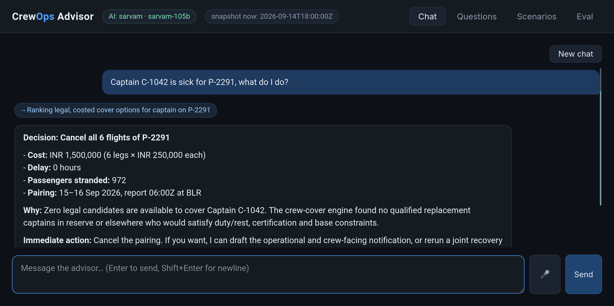
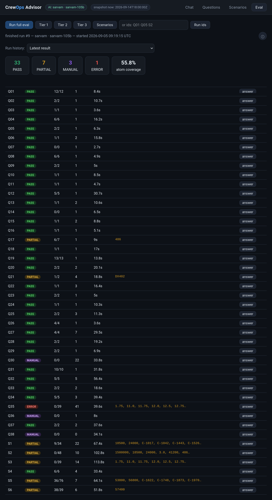

# Crew Ops Advisor

**dCortex "Agentic Crew Ops Advisor" hackathon — team submission.**
A conversational advisor for airline Crew Control: ask it in plain language
who's on reserve, what a sick call breaks, or what to do about it — and get an
answer that is computed, rule-checked, costed, and explained.

Built on one hard rule: **the LLM never computes a number; deterministic code
never interprets language.** The model understands the question, plans tool
calls, and narrates results; every fact, hour, legality verdict and ranking
comes from a deterministic Python engine with a machine-generated reasoning
trace. Full rationale and diagram: [solution/ARCHITECTURE.md](solution/ARCHITECTURE.md).


*Chat: the advisor streams each tool call as a plain-language chip
("→ Ranking legal, costed cover options for captain on P-2291"), with the full
engine result expandable underneath, and takes voice input via the mic button.*


*Eval: the built-in runner grading the live advisor against all 44 dataset
answer keys (run #9: 33 PASS / 7 PARTIAL / 3 MANUAL / 1 ERROR), with per-item
atom coverage, tool-call counts, timings, missing atoms and full transcripts.*

## What's in this repo

| Path | What it is |
|---|---|
| [`solution/`](solution/) | The system: engine, AI layer, CLI, web UI, tests, evals — see [solution/README.md](solution/README.md) for the full layout and run guide |
| [`solution/ARCHITECTURE.md`](solution/ARCHITECTURE.md) | The architecture, including the LLM vs. deterministic boundary diagram and trade-off analysis |
| [`solution/EVALS.md`](solution/EVALS.md) | Catalog of all 44 eval items with prompts, engine mappings, graded atoms and a recorded run |
| [`PRESENTATION.md`](PRESENTATION.md) | Jury-facing deck: requirements coverage, diagrams, eval interpretation, demo script |
| [`PITCH.txt`](PITCH.txt) | Spoken pitch |
| [`DCortex - Synthetic dataset…/`](.) | The provided dataset (10 JSON files + validator), used unmodified |
| [`problem_explanation.pdf`](problem_explanation.pdf) | The problem statement |

## Setup

Requirements: **Python 3.9+, no third-party packages** for the engine, web UI
and Sarvam path. `pip install anthropic` only if using Claude; `pip install
pytest` only for the test suite.

```bash
cd solution

# 1. No-LLM sanity check (runs entirely offline):
python3 run_regression.py        # 41/41 vs the dataset's own answer keys
python3 -m pytest tests/ -q      # 124 tests, < 1 s
python3 cli.py demo              # walk the S2 sick-captain scenario, no key needed

# 2. Wire up an LLM (one key, either provider):
cp .env.example .env             # set LLM_PROVIDER=claude or sarvam + its API key

# 3. Talk to it:
python3 cli.py ask "Captain C-1042 just called in sick — who covers P-2291?"
python3 server.py                # web UI at http://127.0.0.1:8765
```

The web UI has four tabs: **Chat** (streamed answers, live tool-call chips with
expandable engine traces, 🎤 voice input via Sarvam STT), **Questions** and
**Scenarios** browsers with one-click "Test in chat", and **Eval** — run the
full graded eval from the browser and browse every past run.

## Approach in one paragraph

A deterministic engine (`world → rules → query/simulation/recommender`) encodes
the 7 legality rules as pure functions that emit arithmetic traces, simulates
disruptions on copy-on-write overlays, and ranks cover options by
enumerate → 7-rule filter → cost → rank. The LLM sits above a boundary of
**19 typed tools** and does only language: entity resolution, tool planning,
grounded narration. A deterministic groundedness gate flags any id the tools
didn't return; a completeness check re-adds any tool fact the narration
dropped. The provider is a `.env` switch (**Claude** or **Sarvam**) behind one
neutral interface. The dataset is mirrored into SQLite (with JSON fallback),
which also stores the full eval-run history.

## Architecture at a glance

```
  Controller ── 🎤 voice ──▶ Sarvam STT ──┐
      │ text                              ▼
      ▼                       ┌───────────────────────┐
  Web UI (web/index.html) ◀──▶│ server.py (stdlib)    │        cli.py ask/chat
  chat · questions · eval     │ NDJSON stream + REST  │        (same stack, no browser)
                              └──────────┬────────────┘               │
                                         ▼                            ▼
              ┌─────────────────────────────────────────────────────────┐
              │  AI LAYER  crew_ops/llm/ — provider-agnostic            │
              │  Claude ◀── .env switch ──▶ Sarvam                      │
              │  advisor loop: plan → call tools → narrate              │
              │  + groundedness gate + completeness rounds              │
              ╞══ 19 typed tools (crew_ops/tools.py) — THE BOUNDARY ════╡
              │  DETERMINISTIC ENGINE — pure Python                     │
              │  query (Tier 1) · simulation (Tier 2) · recommender     │
              │  (Tier 3) → rules engine: 7 pure checks, every verdict  │
              │  with its arithmetic trace                              │
              │  world state: in-memory indexes, copy-on-write overlays │
              └──────────────────────────┬──────────────────────────────┘
                                         ▼
              SQLite (crew_ops.db): dataset mirror (JSON fallback)
              + full eval-run history
```

Everything above the double line is language; everything below it is
arithmetic. The full diagram and the trade-off analysis behind it:
[solution/ARCHITECTURE.md](solution/ARCHITECTURE.md).

## Results

- **Engine:** 41/41 automated answer-key checks (the 3 open-ended prose
  questions are flagged for human judging, never auto-passed); 124 unit tests.
- **Live LLM eval** (atom-graded: every id, timestamp and non-zero number in
  the answer key must appear in the prose answer): best full 44-item run
  **38 PASS + 3 MANUAL + 2 PARTIAL + 1 ERROR** on Sarvam `sarvam-105b`; every
  auto-graded item has passed in at least one recorded run.
- Tier-1 answers in ~4–15 s; the heaviest Tier-3 scenario answers take 1–2.5
  min with tool calls streaming live.

## Sample input / output

**Tier 3, via CLI or chat:** *"Captain C-1042 just called in sick — who covers P-2291?"*
The engine returns (abridged; every option carries all 7 rule verdicts and an
arithmetic trace):

```json
{ "options": [
  { "action": "Assign Captain C-3310 (reserve callout)", "legal": true,
    "cost_inr": 18500, "delay_hours": 0.0,
    "rules_checked": ["RULE-FDP-01","RULE-DUTY-02","RULE-FLT-03","RULE-REST-04",
                      "RULE-QUAL-05","RULE-CERT-06","RULE-BASE-07"],
    "reasoning": "BLR-based, A320-rated, on-call 06:00-18:00Z, reachable in 45 min; all 7 rules pass" },
  { "action": "Deadhead Captain C-2210 from DEL", "legal": true,
    "cost_inr": 41200, "reasoning": "Legal but incurs deadhead + 3h delay to DX412." }
]}
```

…and the advisor narrates it, including *why* the rejected candidates lost
(e.g. C-2087 would exceed RULE-DUTY-02's 60h/7d by 1h20m; C-3305 is legal on
day 1 but breaches on day 2 of the pairing). Ask "why not C-2087?" as a
follow-up and the same verdict arithmetic comes back. ~40 more worked examples
with expected answers: [solution/EVALS.md](solution/EVALS.md).

## A case we handle poorly (honest failure analysis)

**The engine is deterministic; the narration is not.** The same eval item can
PASS on one run and go PARTIAL on the next — the model occasionally drops a
table row or rounds a number when reciting a large result in prose. The worst
offenders are long numeric tables (Q35, the duty watchlist: 39 graded atoms)
and the biggest scenario answers (S2/S5, 48–76 atoms). We diagnosed the root
causes from recorded transcripts — max-token cut-offs, context overflow from
parallel tool-call bursts, case-sensitive argument mismatches silently
returning zero candidates — and fixed what was fixable deterministically:
argument normalization at the tool boundary, continuation stitching, context
compaction, groundedness + completeness correction rounds, and a deterministic
"[completeness check]" addendum that appends any still-missing tool facts.
That took full-run scores from 31 to 38 PASS, but it is a mitigation, not a
proof: the final full run scored 33 PASS on the same code. The honest statement
is that **correctness lives below the tool boundary and is guaranteed
(41/41); faithful recitation above it is measured, not guaranteed** — which is
exactly why every answer ships with the expandable engine trace, so the
controller reads the computed table, not just the prose. Runner-up risk:
entity resolution ("the VT-DXE captain" → wrong id) — mitigated by echoing
resolved ids back and by tools that reject non-canonical input loudly.

## Key trade-offs

| Decision | Trade-off accepted |
|---|---|
| Tool-calling over a fixed engine, not prompt-stuffing or text-to-SQL | Bounded question vocabulary — out-of-scope questions get an honest refusal, not an attempt |
| Transparent enumerate-filter-rank, not an optimizer | Heuristic joint plans at scale (exhaustive is exact at this dataset's size); explainability wins the trade per the brief |
| Recompute rolling windows from `daily_history` + rostered duties, ignoring the pre-baked `duty_hours_7d` | Slightly more code, but legality is correct on *any* date, not just the snapshot (the Q26/C-3305 traps) |
| Stdlib-only server + single-file UI, SQLite over JSON | No framework polish; zero setup friction and the whole stack runs on a laptop, per the brief's explicit guidance |
| Atom grading for the LLM eval (facts must literally appear in prose) | Strict — a correct answer phrased with a rounded number scores PARTIAL; we prefer a harsh metric that can't flatter us |

## Known limitations

Detailed in [solution/ARCHITECTURE.md §7](solution/ARCHITECTURE.md) and
[solution/README.md](solution/README.md): narration variance (above), rest
checks limited by history granularity (no per-duty timestamps), RULE-FLT-03
read stricter than the answer keys, open-ended questions flagged `MANUAL`, and
the Claude path built and unit-tested but not exercised live during the
hackathon (Sarvam was, end-to-end, including voice).

**PII note (production):** crew names and reachability are personal data. The
boundary helps: engine-side role-based redaction means sensitive fields never
enter the prompt; the SQLite-logged tool transcripts double as an audit
record. Commentary in [ARCHITECTURE.md §8](solution/ARCHITECTURE.md).

## Deliverables checklist (per the problem statement)

- ✅ Source code repository — this repo
- ✅ Architecture diagram incl. the LLM vs. deterministic boundary — [solution/ARCHITECTURE.md §2](solution/ARCHITECTURE.md)
- ✅ README with setup, approach, trade-offs — this file + [solution/README.md](solution/README.md)
- ✅ Sample inputs/outputs incl. a failure case with analysis — above + [solution/EVALS.md](solution/EVALS.md)
- ✅ Presentation deck — [PRESENTATION.md](PRESENTATION.md)
- ✅ Live demo — `python3 server.py` (or `cli.py demo` with no API key at all)
